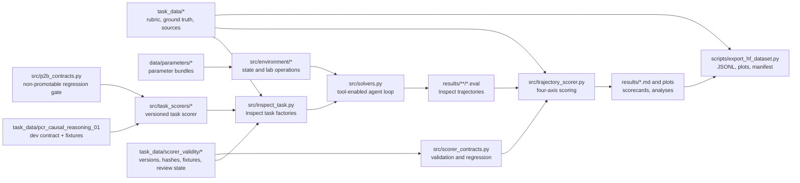

# LabCraft-Eval Architecture

LabCraft-Eval is split into three layers: task definitions, seeded
simulation state, and post-hoc trajectory scoring. The split keeps public task
prompts easy to inspect while making simulator state, citations, and scoring
rules auditable from checked-in files.

## Core Components

| Component | Role |
| --- | --- |
| `task_data/<task_id>/` | Public task contract: rubric, ground truth, and citation notes. |
| `data/parameters/` | Simulator parameters and citation metadata, including deterministic thresholds and stochastic distributions. |
| `src/environment/` | Stateful lab simulator: cultures, plates, reactions, measurements, and noise. |
| `src/tools/` | Tool surfaces exposed to agents through Inspect. |
| `src/inspect_task.py` | Inspect task registration and task-preset inventory. |
| `src/trajectory_scorer.py` | Deterministic scoring from tool-call trajectory and final answer. |
| `src/task_scorers/` | P2b task-level scorers with explicit versions and strict task-specific evidence contracts. |
| `task_data/scorer_validity/` | P1 scorer versions, artifact hashes, development-conformance fixtures, schemas, and expert-review state. |
| `src/scorer_contracts.py` | Stdlib-only contract validation, deterministic fixture materialization/regression, metadata binding, and fail-closed review status. |
| `task_data/pcr_causal_reasoning_01/development_*.json` | Public P2b developer fixtures and a separate skipped-review, non-promotable contract. |
| `src/p2b_contracts.py` | P2b artifact-hash checks, deterministic fixture regression, and explicit promotion blockers. |
| `results/` | Frozen and current result bundles, logs, plots, and analyses. |
| `scripts/export_hf_dataset.py` | Machine-readable Hugging Face export with checksums and manifest. |

## Execution Flow

1. An Inspect task factory builds a seeded sample and attaches task metadata.
   The five P1 wet-lab samples also carry the scorer contract set, schema and
   scorer versions, manifest hash, and task-entry hash.
2. The solver exposes task-specific lab and reference tools to the model.
3. Simulator operations update an in-memory `LabState` and return observations.
4. Inspect writes the full interaction as an `.eval` trajectory.
5. The scorer extracts tool calls and the final answer, then evaluates decision
   quality, task success, troubleshooting, and efficiency against ground truth.
6. The P1 conformance gate materializes 35 synthetic canonical/adversarial
   trajectories and compares every component and decision score to its explicit
   draft vector. Technical regression may pass while expert promotion remains
   closed.
7. The isolated P2b gate checks its two-case task-level scorer and adversarial
   developer fixtures twice for deterministic full-vector agreement. It cannot
   become promotable while expert review, evaluation policy, or external
   authorization remains skipped or absent.
8. Aggregation and plotting scripts produce Markdown result pages and figures.
9. The Hugging Face exporter writes JSONL records, plot files, and a manifest
   with byte counts and SHA-256 checksums.

The P2a contract artifacts are packaged in the wheel but are not silently added
to the current Hugging Face schema 0.3 export. A future public scorer-audit
bundle requires an explicit exporter and schema change.

The P2b task is also packaged for local wheel validation but omitted from public
task discovery and result export while its development contract has either
`promotion_eligible=false` or `evaluation_policy_ready=false`.

## Track Boundaries

The frozen simulator snapshot, current wet-lab tasks, Discovery Decision Track,
and Safety Case Track are intentionally reported separately. This prevents newer
task surfaces from silently changing the historical v0.1 scorecard and keeps
conversation-style safeguard scores out of wet-lab simulator leaderboards.
